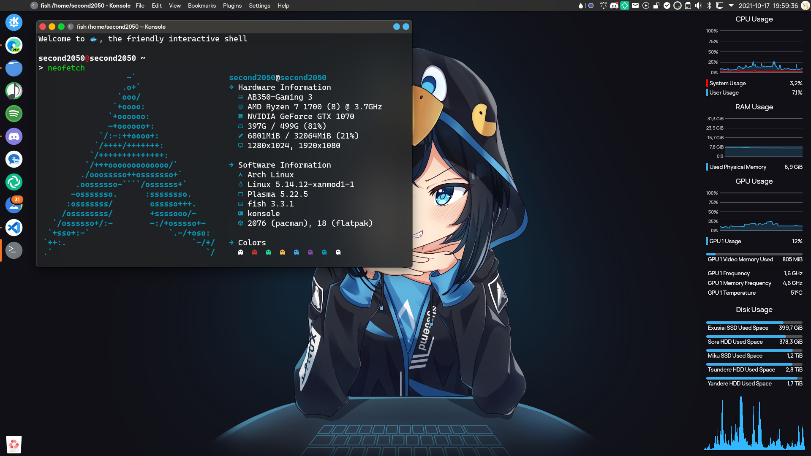

# New Unity
A Unity like Layout for Latte Dock

New Unity as it is in use on my Desktop

---
## How to use
### <u>Prerequisites:</u>
- [Latte Dock](https://invent.kde.org/plasma/latte-dock) (You need a version compiled from the latest commits)  
***~~This does not work with the stable build of Latte Dock as of February 2021~~***  
***As of the 6th of August 2021 you can use the stable version of Latte Dock (v0.10) for this.***
- Third Party Plasmoids:
  - [Window Buttons](https://store.kde.org/p/1272871/)
  - [Window Title](https://store.kde.org/p/1274218/)
  - [Window AppMenu](https://store.kde.org/p/1274975/)
    - This is replaceable with the default Plasmoid "Global Menu"
  - [USwitcher](https://store.kde.org/p/1194339)
- [My layout file](New-Unity.layout.latte)

### <u>"Installing":</u> 
0. Install Latte Dock and the Third Party Plasmoids
1. Start Latte Dock
2. Remove all plasma panels
3. Right Click onto your Latte Dock and click on "Configure Latte..." 
4. Click on "Import..." and choose my layout file
5. the switch to the "Preferences" tab and enable 
   "Support borderless maximized windows in different layouts"
6. Click on "Apply"
7. Click on the layout "New Unity" and then on the button "Switch"

### <u>Verifying that everything works™:</u>
You should now check if everything is correctly loaded
1. Open a new Dolphin window and maximize it
2. Now check if the top bar has all plasmoids (from left to right):
   - Window Buttons (Close, Maxmimize/Restore, Minimize buttons)
   - Window Title (It should show the application title; in this case "Dolphin")
   - Window AppMenu (The menu bar of the application)
   - System Tray
   - Clock
   - USwitcher
3. Now check if the side bar has all plasmoids (from top to bottom):
   - Application Launcher
   - Latte Tasks (The many application icons)
   - Trash

Is everything loaded?
- Yes! — Good!
- No!
  - Try to add the missing plasmoids via: Right Click -> Add Widget  
    If the plasmoid isn't shown in the list make sure the plasmoid is correctly installed  
    Instructions should be available if needed at the plasmoid page linked above

### <u>Editing the layout to better suit you:</u>
You can edit the layout by right clicking onto the panels and choosing either "Add Widgets" to add Plasmoids or "Edit Panel" to edit the current panel.

---
## More Stuff (from the screenshot):
- Qt5: [Lightly](https://github.com/Luwx/Lightly) by [Luwx](https://github.com/Luwx) 
- Icons: [Tela Circle](https://github.com/vinceliuice/Tela-circle-icon-theme) by [Vince](https://github.com/vinceliuice)
- Wallpaper: [Arch chan](https://www.deviantart.com/raviolimavioli/art/Arch-chan-878404999) by [RavioliMavioli](https://www.deviantart.com/raviolimavioli)
